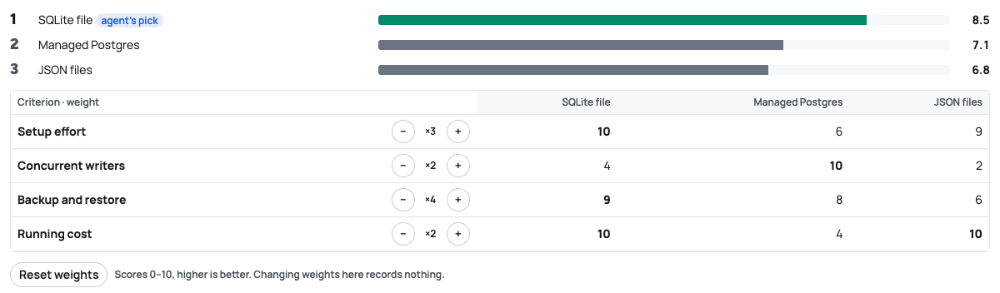
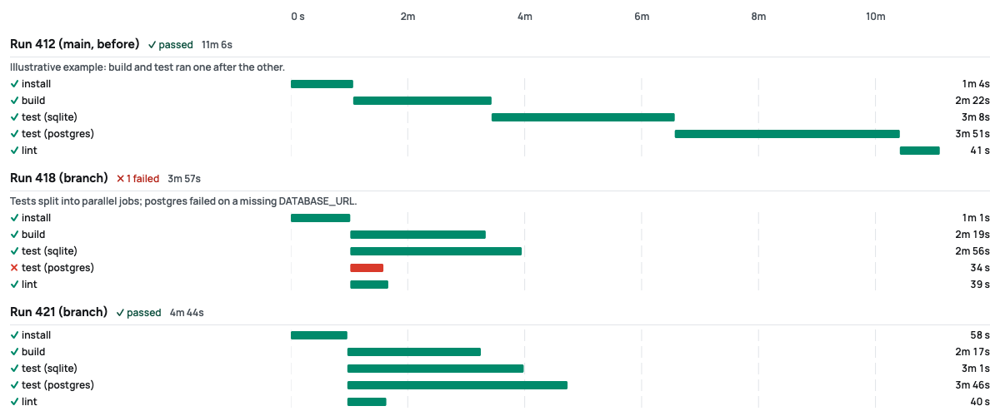
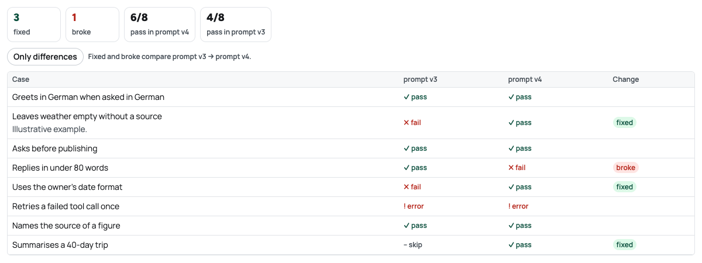
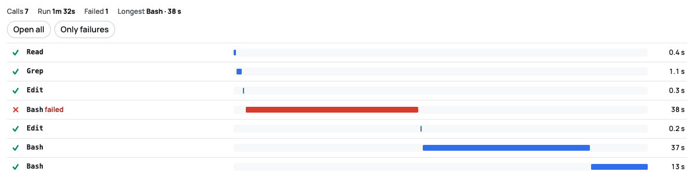

# orch-core

**Let coding agents do the work. Keep every decision yours.**

orch-core is a Claude Code plugin that runs agent work through local Markdown tickets with a human gate at every step. Agents file tickets, draft requirements and plans, work task lists and hand finished work over for testing, all through one CLI, `orch`. Approving requirements and plans, answering questions and the final verdict stay with you, and the plugin enforces that.

No server, no account, no SaaS. Tickets are Markdown files in `orchestrator/tickets/` in your own repository, versioned with your code.

## Why

Agents are fast. They are also confident, and they will happily approve their own plan, mark their own work done or quietly widen the scope. orch-core gives them a real workflow with hard edges:

- **Human gates that hold.** Approvals, answers and verdicts are bound to a hash of the exact text you saw and signed into a per-user ledger outside the repository. An agent proceeds only on decisions that ledger holds.
- **A guard hook.** A Claude Code `PreToolUse` hook stops agents from editing ticket status by hand, running human-only commands or doing git actions the workspace does not allow.
- **Agents that wait instead of guessing.** `orch ask` parks a question with options, costs and a recommended default; `orch wait` blocks until you answer.
- **Proof, not claims.** Every ticket carries acceptance criteria, a task list ticked with evidence and linked artifacts (screenshots, reports, PRs) before it can reach testing.

## Features

- **`orch` CLI**: `new`, `list`, `show`, `search`, `next`, `related`, `graph`, `claim`, `task`, `ask`, `wait`, `log`, `link`, `artifact`, `quick`, `move`, `check`, `doctor`, plus the human-only `approve`, `request-changes`, `answer` and `verdict`.
- **Skills** for Claude Code: `orch-tickets`, `orch-refine-ticket` (requirements engineering), `orch-work-on-ticket` (claim, plan, implement, verify) and `orch-setup` (guided onboarding).
- **Hooks**: the guard, and a `SessionStart` hook that prints the active rules, your claimed tickets and what is waiting on you.
- **Commit check**: an optional git `commit-msg` hook (`orch hooks install`) that requires a ticket key in every commit.
- **Quick tasks**: one-line jobs too small for a ticket (`orch quick`), closed with one line of proof; a size limit turns one that grows into a ticket ([docs](plugins/orch-core/docs/quick-tasks.md)).
- **Epics and sprints**: approve an epic once for all its children, optionally delegate small follow-ups, plan in sprints.
- **Ticket widgets**: agents put charts, check tables, diffs, before/after sliders and other small visual blocks into tickets, drawn safely and pinned into the verdict you sign ([format](plugins/orch-core/docs/widgets.md)).
- **Mission Control**: a local web dashboard for everything that needs you.
- **Schedules**: run a workspace skill on a clock or when an orch event happens, or put a recurring ticket on Today; you arm each one, signed and pinned to its skill, and whatever a run finds waits for you ([docs](plugins/orch-core/docs/schedules.md)).
- **Addons**: GitHub reviews and issues, Databricks, a wiki and agent terminals ship in the box; write your own against a small, documented API.
- **GitHub Copilot** support for the skills and the CLI.

## Install

You need [uv](https://docs.astral.sh/uv/getting-started/installation/) (the plugin runs the CLI with `uv run`, Python 3.11 or newer) and Claude Code with plugin support.

```bash
claude plugin marketplace add severinlindenmann/orch-core
claude plugin install orch-core@orch-core
```

The plugin is installed for one *scope*: `--scope user` (every project of yours), `--scope project` (this repository, shared through `.claude/settings.json`) or `--scope local`. Pass it explicitly (`claude plugin install orch-core@orch-core --scope user`); a plugin installed in the scope of another project does not load here, and `claude plugin list` shows where it is enabled.

Then, in the repository you want to work in, run `/orch-core:setup` or just say *"set up orch here"*. The setup skill asks one question at a time (ticket prefix, external tracker, git host, what agents may do on their own) and runs `orch init` only after you say yes.

Human decisions run in your own terminal, not through an agent, so install the CLI there once:

```bash
uv tool install "<plugin folder>[dashboard]"
```

`orch doctor` prints this command with the real plugin folder filled in.

For GitHub Copilot, the setup without the plugin and switching an existing workspace over, see the [plugin README](plugins/orch-core/README.md#install).

## Quick start

The loop, with the agent's half and yours:

```bash
# Agent: capture a request as a backlog ticket with requirements and acceptance criteria
orch new --title "Add dark mode" --requirements-file req.md --acceptance-file ac.md

# You: approve the requirements (and, for larger tickets, the plan)
orch approve L-0001   # requirements, and the plan too when both wait: one confirmation

# Agent: pick up the next open ticket and plan it as a task list
orch next
orch claim L-0001
orch task add L-0001 --file tasks.yaml

# Agent: work it down, one task at a time, with evidence
orch task start L-0001 T1
orch task done L-0001 T1 -m "toggle renders in both themes, screenshot attached"
orch artifact add L-0001 screenshot.png --task T1

# Agent: stuck on a decision? Ask, then wait for the answer
orch ask L-0001 --file questions.yaml
orch wait L-0001

# Agent: hand over for testing
orch move L-0001 testing

# You: accept it or send it back
orch verdict L-0001 done
```

Statuses run `backlog → open → in-progress → waiting → testing → done`. Agents stop at `testing`; a person closes the ticket.

## Mission Control

`orch serve`, run in your own terminal, opens a local dashboard. Everything is served locally, fonts included, and every write goes through the same rules as the CLI.

- **Today**: what waits for you, blocking first. Each card shows the full text it binds and one primary action: answer, approve requirements and plan side by side, or give a verdict against a checklist of acceptance criteria with their evidence.
- **Board**: your decisions on top, the agents' flow below (Ready, Working, Waiting, Testing), a backlog drawer, swimlanes by epic, sprint, label, agent or repo, and a sortable list view.
- **Ticket pages**: the ticket as a story, from what was asked through what was agreed, the work, the proof per criterion and the verdict, with artifacts and the event timeline.
- **Graph**: which tickets changed which code (from commit subjects), dependency lanes per epic, and the links around one ticket. Files that two open tickets both change are marked as collisions; clicking a node shows what an agent reads with `orch related`.
- **Activity and Reports**: which agents are working or stale, and lead time, waiting time and sent-back rate over time.
- **Workspace & addons**: setup checks with copyable fixes, addon trust and settings, and keyboard shortcuts (`j`/`k`, `1`–`9`, `⌘K`).

Light, dark and auto themes; it works on a phone too.

## Ticket widgets

Agents prove their work with small visual blocks inside the ticket instead of walls of text. Each block is a fenced `orch` JSON object, drawn by core in a sandboxed frame, with its template and files pinned into the verdict you sign. A few of the built-ins, with their example data:









The format, every built-in type and the security model are in [docs/widgets.md](plugins/orch-core/docs/widgets.md).

## Addons

Addons add pages and panels to Mission Control. Several ship with the plugin, all off until you enable them per workspace:

| Addon | What it shows |
|---|---|
| `github-reviews` | Open pull requests linked to tickets, their checks, rerun failed runs, mark ready |
| `github-issues` | Issues next to their tickets, import an issue as a ticket, close and reopen in sync |
| `databricks` | Workspaces, failed job runs, pipelines and compute, read-only through the `databricks` CLI |
| `wiki` | Related wiki pages on each ticket and "may need an update" hints, from a GitHub wiki or a local Markdown folder |
| `terminals` | Run, watch and type into agent sessions from Mission Control (needs tmux) |
| `schedules` | Workspace skills on a clock or an orch event, and recurring tickets; findings on Today (needs tmux) |
| `quick-tasks` | Quick tasks: one-line jobs too small for a ticket, a list in Mission Control, `orch quick` for agents, a size limit |
| `model-routing` | Start each agent session on a model chosen by its Start agent mode, a subagent model, one tier up after a task failed its verify twice |

Custom addons are installed with `orch addon install <folder | git URL>` and run only after you trust that exact version; any change disables them until you review it again. Agents can never install, trust or enable an addon. To write one, read [ADDONS.md](plugins/orch-core/ADDONS.md) and start from [addon-template/](plugins/orch-core/addon-template/). Widget and copy rules are in [DESIGN.md](plugins/orch-core/DESIGN.md).

## orch-session

A second, optional plugin shows the tickets the current Claude Code session holds right inside Claude Code: a status line, a band above the prompt, an `/orch` pane and toasts on hand-overs. It needs a Claude Code build with function-hook plugins.

```bash
claude plugin install orch-session@orch-core
```

See [plugins/orch-session/README.md](plugins/orch-session/README.md).

## Documentation

- [Plugin README](plugins/orch-core/README.md): the full reference, including who counts as the human, epics, task lists, Start agent and what goes into git
- [ADDONS.md](plugins/orch-core/ADDONS.md): writing addons
- [DESIGN.md](plugins/orch-core/DESIGN.md): Mission Control's design system
- [Ticket schema](plugins/orch-core/docs/ticket-schema.md), [task list format](plugins/orch-core/docs/tasks-format.md) and [ticket widgets](plugins/orch-core/docs/widgets.md)

## Development

From `plugins/orch-core`:

```bash
uv sync --extra dev --extra dashboard
uv run pytest -q
```

CI runs the tests on Ubuntu and Windows with Python 3.11 and 3.13.

## Contributing and security

See [CONTRIBUTING.md](CONTRIBUTING.md) for how to run the checks locally. Report vulnerabilities privately as described in [SECURITY.md](SECURITY.md), never as a public issue.

## License

Apache License 2.0. See [LICENSE](LICENSE).
